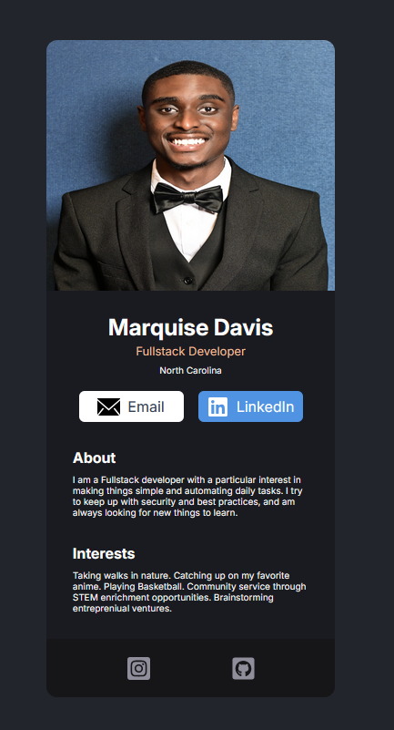

# React Business Card

<!-- PROJECT SHIELDS -->
[![Contributors][contributors-shield]][contributors-url]
[![Forks][forks-shield]][forks-url]
[![Stargazers][stars-shield]][stars-url]
[![Issues][issues-shield]][issues-url]
[![LinkedIn][linkedin-shield]][linkedin-url]

<!-- PROJECT LOGO -->
<br />
<div align="center">
  <a href="https://github.com/codingmaniac227/react-business-card" target="_blank" rel="noopener">
    
  </a>

  <h3 align="center">React Business Card</h3>

  <p align="center">
    A clean, responsive business card built with React + Vite.
    <br />
    <a href="https://github.com/codingmaniac227/react-business-card" target="_blank" rel="noopener"><strong>Explore the docs »</strong></a>
    <br />
    <br />
    <a href="https://react-business-card-demo.netlify.app" target="_blank" rel="noopener">View Demo</a>
    ·
    <a href="https://github.com/codingmaniac227/Project-React-Business-Card/issues/new?template=bug_report.yml&labels=bug" target="_blank" rel="noopener">Report Bug</a>
    ·
    <a href="https://github.com/codingmaniac227/Project-React-Business-Card/issues/new?template=feature_request.yml&labels=enhancement" target="_blank" rel="noopener">Request Feature</a>
  </p>
</div>

---

## Table of Contents
<details>
  <summary>Expand</summary>
  <ol>
    <li><a href="#about-the-project">About The Project</a></li>
    <li><a href="#built-with">Built With</a></li>
    <li><a href="#getting-started">Getting Started</a></li>
    <li><a href="#usage">Usage</a></li>
    <li><a href="#roadmap">Roadmap</a></li>
    <li><a href="#contributing">Contributing</a></li>
    <li><a href="#contact">Contact</a></li>
    <li><a href="#acknowledgments">Acknowledgments</a></li>
  </ol>
</details>

---

## About The Project

<p align="center">
  
</p>

This is a simple, accessible “business card” site. It features:

- A full-bleed profile image with rounded-card clipping.  
- Semantic layout (`header`, `main`, `section`, `footer`) for SEO and screen readers.  
- Email + LinkedIn buttons with icon+label alignment.  
- Footer social icons with tight hoverable hitboxes.  
- Clean centering and a contained text column inside the card.

The project is great for refreshing React + CSS fundamentals and demonstrates patterns like:
- Flex “push-down” footer (`margin-top: auto` / `flex: 1` on middle content).  
- Edge-to-edge media with padded content using an inner “card body.”  
- Scoped styles for header CTAs vs. footer icons.

<p align="right">(<a href="#react-business-card">back to top</a>)</p>

---

## Built With

* [![React][React.js]][React-url]
* [![Vite][Vite.js]][Vite-url]
* Vanilla CSS (component-scoped `.css` files)
* (Optional) SVGR for inline SVGs

<p align="right">(<a href="#react-business-card">back to top</a>)</p>

---

## Getting Started

### Prerequisites
- **Node** & **npm** installed.
```sh
npm install npm@latest -g
```

### Installation
1. Clone the repo
    ```sh
    git clone https://github.com/codingmaniac227/react-business-card.git
    ```
2. Install deps
   ```sh
   npm install
   ```
3. Run dev server
   ```sh
   npm run dev
   ```

#### Project Structure (high level)
```
src/
  assets/          # images & svg icons (headshot, social icons)
  components/      # Info, About, Interests, Footer
  App.jsx
  index.css
  main.jsx
```

<p align="right">(<a href="#react-business-card">back to top</a>)</p>

---

## Usage

- Replace `src/assets/headshot.jpg` with your own headshot (same name/path or update the import in `Info.jsx`).  
- Update copy in:
  - `Info.jsx` (name, title, location, links)
  - `About.jsx`, `Interests.jsx`
- To open links in a new tab, add `target="_blank" rel="noopener"` on your `<a>` tags.  
- Deploy anywhere (e.g., Netlify). No runtime server required.

**Live Demo:** <a href="https://react-business-card-demo.netlify.app" target="_blank" rel="noopener">https://react-business-card-demo.netlify.app</a>

<p align="right">(<a href="#react-business-card">back to top</a>)</p>

---

## Roadmap

- [x] Core card layout (image, headings, buttons, sections, footer)  
- [x] Centered card with responsive layout  
- [ ] Theme switch (dark/light)  
- [ ] Downloadable vCard / QR code  
- [ ] Tests for layout regressions

<p align="right">(<a href="#react-business-card">back to top</a>)</p>

---

## Contributing

Contributions are welcome!

1. Fork the project  
2. Create your feature branch (`git checkout -b feature/AmazingFeature`)  
3. Commit your changes (`git commit -m 'feat: add AmazingFeature'`)  
4. Push to the branch (`git push origin feature/AmazingFeature`)  
5. Open a Pull Request

<p align="right">(<a href="#react-business-card">back to top</a>)</p>

---

## Contact

Marquise Davis – <a href="https://instagram.com/FullStackDemon" target="_blank" rel="noopener">@FullStackDemon</a>
codingmaniac227@gmail.com  
Project Link: <a href="https://github.com/codingmaniac227/react-business-card" target="_blank" rel="noopener">https://github.com/codingmaniac227/react-business-card</a>

<p align="right">(<a href="#react-business-card">back to top</a>)</p>

---

## Acknowledgments

- React + Vite community
- Netlify for quick deploys
- Everyone who shares CSS layout tips and accessibility guidance

<p align="right">(<a href="#react-business-card">back to top</a>)</p>

---

<!-- MARKDOWN LINKS & IMAGES -->
[contributors-shield]: https://img.shields.io/github/contributors/codingmaniac227/Project-React-Business-Card?style=for-the-badge
[contributors-url]: https://github.com/codingmaniac227/Project-React-Business-Card/graphs/contributors
[forks-shield]: https://img.shields.io/github/forks/codingmaniac227/Project-React-Business-Card?style=for-the-badge
[forks-url]: https://github.com/codingmaniac227/Project-React-Business-Card/network/members
[stars-shield]: https://img.shields.io/github/stars/codingmaniac227/Project-React-Business-Card?style=for-the-badge
[stars-url]: https://github.com/codingmaniac227/Project-React-Business-Card/stargazers
[issues-shield]: https://img.shields.io/github/issues/codingmaniac227/Project-React-Business-Card?style=for-the-badge
[issues-url]: https://github.com/codingmaniac227/Project-React-Business-Card/issues
[linkedin-shield]: https://img.shields.io/badge/-LinkedIn-black.svg?style=for-the-badge&logo=linkedin&colorB=555
[linkedin-url]: https://www.linkedin.com/in/marquise-davis/
[React.js]: https://img.shields.io/badge/React-20232A?style=for-the-badge&logo=react&logoColor=61DAFB
[React-url]: https://react.dev/
[Vite.js]: https://img.shields.io/badge/Vite-646CFF?style=for-the-badge&logo=vite&logoColor=FFD62E
[Vite-url]: https://vitejs.dev/
